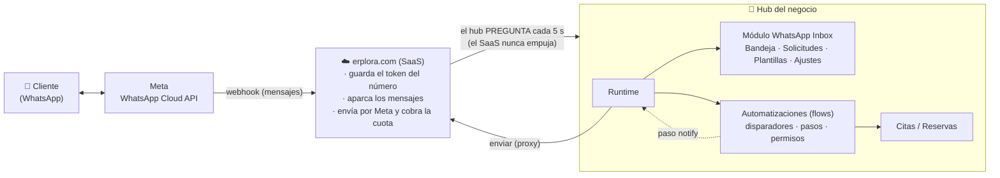
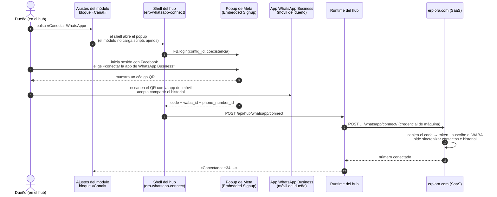
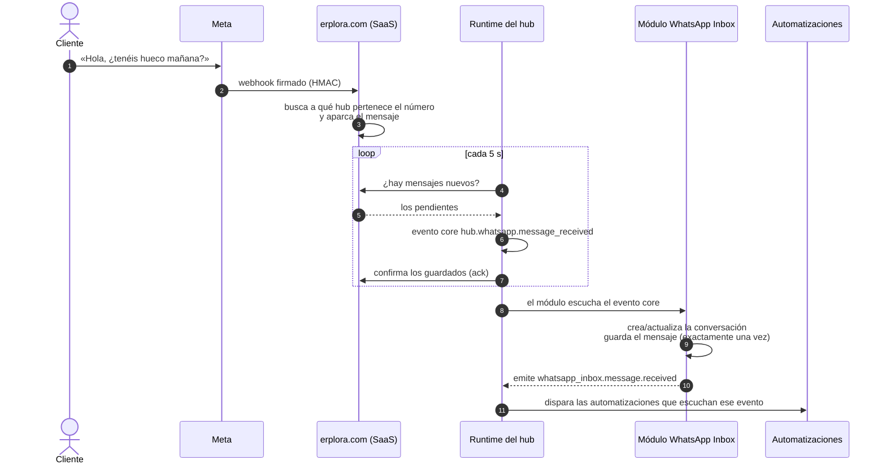
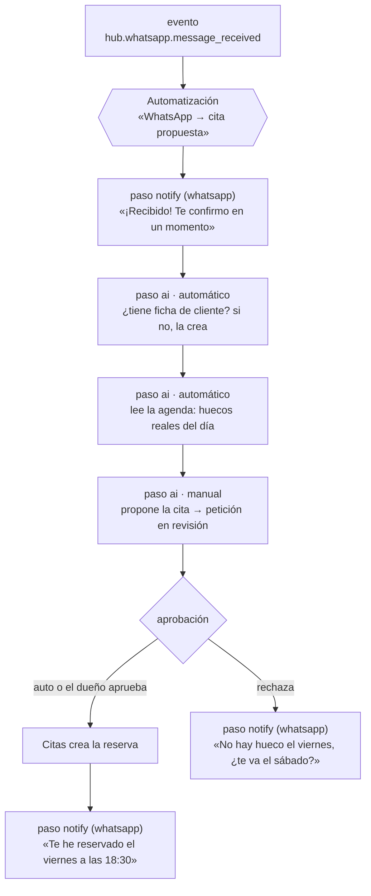
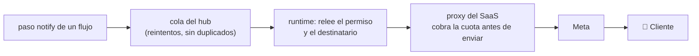
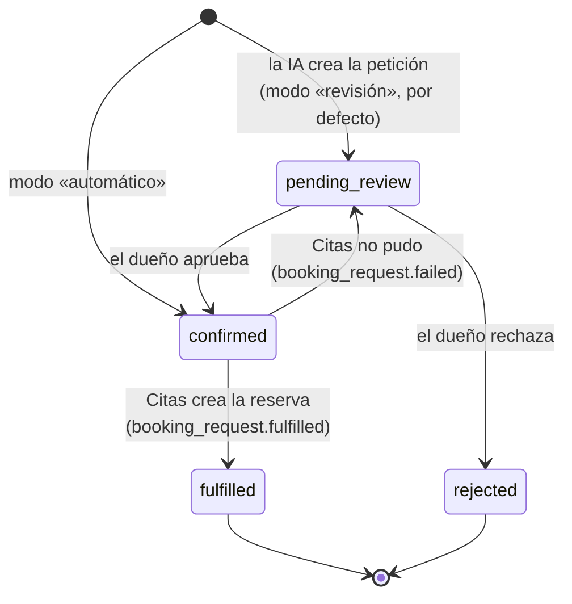

# WhatsApp Inbox — cómo funciona, con dibujos

> Esta guía explica el módulo **de punta a punta** para que cualquiera lo entienda en cinco minutos:
> qué pasa cuando un cliente escribe por WhatsApp, cómo se conecta el número, cómo lo usa
> **Automatizaciones** para contestar y reservar, y dónde termina cada cosa. Los detalles de
> contrato (queries, commands, esquemas) están en [`overview.md`](overview.md),
> [`concepts.md`](concepts.md), [`screens.md`](screens.md) y [`limits.md`](limits.md); la
> arquitectura, en `architecture/modules/whatsapp_inbox.md`.

## 1. En una frase

Un cliente escribe al WhatsApp del negocio, el mensaje aparece en la **Bandeja** del hub, una
**automatización** le contesta al momento y, si pide cita o mesa, la **IA** mira la agenda real y la
propone o la confirma. El dueño ve todo en su hub, y sigue usando la app de WhatsApp Business del
móvil como siempre.

## 2. Las piezas y quién habla con quién



Tres reglas que explican el dibujo:

- **Meta solo habla con un servidor**: erplora.com. Por eso el webhook, el token cifrado del
  número y el envío viven en el SaaS. El hub **nunca** guarda credenciales de Meta.
- **El SaaS no puede llamar al hub** (está detrás del router del negocio). El hub **pregunta** cada
  cinco segundos si hay mensajes nuevos y confirma los que ya guardó. Si el hub se apaga, los
  mensajes esperan en el SaaS.
- **El módulo no envía nada por sí mismo.** Quien contesta es un paso `notify` de una
  automatización, que pasa por el runtime y por el proxy del SaaS, que cobra antes de gastar.

## 3. Conectar el número (una vez)

Se hace **en el hub**, en Ajustes del módulo de WhatsApp, bloque **Canal**. Solo un dueño o un
administrador puede hacerlo. Hace falta el móvil con la app de **WhatsApp Business** instalada y un
número que **no** esté ya conectado a la Cloud API de Meta.



Lo que conviene saber:

- **Coexistencia.** El número sigue funcionando en la app del móvil. ERPlora y la app comparten
  el mismo número. Es el caso real de una peluquería o un bar.
- **Qué guarda quién.** El SaaS guarda el token cifrado y el PIN de registro; el hub solo sabe
  «hay un número conectado, es este». Desconectar se hace en el mismo bloque.
- **Si el hub es antiguo**, el bloque lo dice («actualiza el hub») en vez de enseñar un botón que no
  haría nada.
- **Hoy** solo se pueden conectar números del portfolio de Meta de ERPlora, hasta que Meta verifique
  el negocio y apruebe la app (trámite en `ERPlora/pm#277`). Es un límite de Meta, no del código.

## 4. Llega un mensaje



- **Exactamente una vez.** Cada mensaje de Meta tiene un identificador único; el SaaS y el módulo
  lo usan como llave, así que un reintento de Meta o un reinicio del hub nunca duplican un mensaje.
- **La Bandeja** muestra la conversación con su contador de no leídos; abrirla marca los mensajes
  como leídos.
- **El teléfono del cliente** se normaliza a formato internacional (`+34…`) y se enlaza a la ficha
  de cliente si existe (referencia blanda: no se rompe nada si no existe).

## 5. Cómo lo usa Automatizaciones (el módulo `flows`)

Automatizaciones no sabe nada de WhatsApp «por dentro». Trabaja con **eventos**, **pasos** y
**permisos**, y el módulo de WhatsApp le da las tres cosas:

| Lo que Automatizaciones necesita | Lo que le da WhatsApp Inbox |
|---|---|
| Un **disparador** | El evento del núcleo `hub.whatsapp.message_received` (trae `from` y `text`) o el del módulo `whatsapp_inbox.message.received` (y los demás de la tabla de abajo) |
| Un **destinatario** para contestar | La query `whatsapp_inbox.conversations.list`, campo `contact_phone` (se concede como `recipient_query`) |
| Un **canal** para el paso `notify` | `whatsapp`, que sale por el proxy del SaaS (se concede como `notify`) |
| **Lecturas** para que la IA entienda el contexto | `whatsapp_inbox.conversations.get`, `whatsapp_inbox.messages.list`, y las queries de Citas para los huecos |



**Los permisos mandan.** Una automatización no puede escribir a nadie ni leer nada que el dueño no
le haya concedido en su pantalla de permisos. Para el flujo de arriba hacen falta, como mínimo:

- `notify` → canal `whatsapp` (cada WhatsApp cuesta dinero; conceder email no es conceder WhatsApp);
- `recipient_query` → `whatsapp_inbox.conversations.list#contact_phone` (a quién se escribe se
  **lee** de la conversación, nunca se teclea);
- `query` → las lecturas de los pasos de IA: `customers.list`, `services.services.list`,
  `staff.members.list`, `staff.schedules.list_for_member`, `appointments.appointments.conflicting`;
- `command` → los de **disponibilidad** de Citas, que son commands aunque solo lean
  (`appointments.availability.day_opening`, `.slots`, `.check`), y las escrituras del paso manual:
  `customers.create` y `appointments.appointments.create`.

Todos vienen listados en `flows/appointment-from-whatsapp.grants.json`, que es lo que la pantalla de
permisos de Automatizaciones ofrece conceder de una vez.

Revocar un permiso corta el envío **aunque el mensaje ya estuviera en cola**.

**Un ejemplo mínimo** — «cuando alguien escribe, contéstale que lo hemos recibido». Es el primer
paso de la plantilla real que viaja con el módulo, tal cual:

```json
{
  "schema_version": 1,
  "triggers": [
    {
      "kind": "event",
      "event": "hub.whatsapp.message_received",
      "filter": { "event.text": { "neq": "" } },
      "input": { "from": "event.from", "text": "event.text", "received_at": "event.received_at" }
    }
  ],
  "steps": [
    {
      "id": "acknowledge",
      "kind": "notify",
      "channel": "whatsapp",
      "to": {
        "query": "whatsapp_inbox.conversations.list",
        "params": { "f_wa_contact_id": "input.from" },
        "field": "contact_phone"
      },
      "template": "",
      "vars": { "text": "¡Gracias por escribirnos! Hemos recibido tu mensaje. Te confirmamos en cuanto abramos." }
    }
  ]
}
```

Dos detalles que importan: el **disparador** es el evento del núcleo `hub.whatsapp.message_received`
(trae `from`, `text` y `received_at`, que el `input` deja a mano para los pasos); el evento del módulo
`whatsapp_inbox.message.received` también sirve como disparador cuando lo que interesa es la
conversación ya guardada. Y el **destinatario** se lee de la conversación (`f_wa_contact_id` =
`input.from`): no hay forma de escribir un teléfono a mano en un flujo, a propósito.

**Dónde se crea.** En Automatizaciones, desde la galería o desde el editor. La plantilla completa
«WhatsApp → cita propuesta» viaja con este módulo (`flows/appointment-from-whatsapp.es.flow.json`,
con sus permisos en `appointment-from-whatsapp.grants.json`); mientras la galería no la ofrezca
(`ERPlora/flows#52`), se crea con ese documento desde el editor. Se crea **desactivada y sin
permisos**: el dueño concede los permisos, la revisa y la activa.

**Los eventos que puede usar una automatización:**

| Evento | Cuándo salta |
|---|---|
| `whatsapp_inbox.message.received` | Entra un mensaje de un cliente |
| `whatsapp_inbox.request.created` | La IA ha extraído una petición (cita, reserva, pedido, presupuesto) |
| `whatsapp_inbox.request.approved` · `.rejected` · `.fulfilled` · `.deleted` | La petición cambia de estado |
| `whatsapp_inbox.conversation.assigned` | Se asigna la conversación a una persona |
| `whatsapp_inbox.template.created` · `.updated` · `.deleted` | Cambian las plantillas |
| `whatsapp_inbox.settings.updated` | Cambian los ajustes del canal |

Y los que el módulo **escucha**: `hub.whatsapp.message_received` (del núcleo del hub) y
`appointments.booking_request.fulfilled` / `.failed` (Citas dice si materializó la reserva).

## 6. Responder

Nadie responde «desde la Bandeja»: la respuesta la manda una automatización (paso `notify`) o el
dueño desde la app del móvil. Cómo sale un mensaje del hub:



- Si se agota la cuota del plan, el SaaS contesta `429 quota_exceeded` **sin** llamar a Meta y el
  paso queda en la cola con su motivo visible en el hub.
- Lo que el dueño contesta **desde el móvil** todavía no aparece en la Bandeja (`ERPlora/saas#1883`);
  el historial anterior a la conexión, tampoco (`ERPlora/saas#1884`).

## 7. Las peticiones (Solicitudes)

Cuando la IA entiende que el cliente pide algo concreto, lo guarda como **petición** con su
referencia (`WA-20260906-0007`) y los datos extraídos (servicio, fecha, personas…).



- **Revisión o automático** se elige en Ajustes (`approval_mode`). Por defecto, revisión: lo que
  propone una IA lo confirma una persona, como en Square, Fresha o Booksy.
- **Una petición atendida no se borra**: es el rastro de lo que se prometió al cliente.

## 8. Las cuatro pantallas

| Pantalla | Para qué |
|---|---|
| **Bandeja** | Conversaciones, no leídos, abrir el hilo, asignar a una persona |
| **Solicitudes** | Peticiones extraídas por la IA: aprobar, rechazar, ver qué se creó |
| **Plantillas** | Las plantillas aprobadas por Meta que puede usar un paso `notify` |
| **Ajustes** | Bloque **Canal** (conectar el número, consumo del mes frente a cuota) y modo de aprobación |

No hay campo de token ni de secreto en ninguna pantalla, a propósito: las credenciales viven en
el SaaS y el hub no las ve nunca.

## 9. Dinero y límites

- El módulo es **de pago con capa gratuita**: un número de mensajes entrantes al mes. El SaaS lleva
  el contador y el módulo lo enseña en Ajustes; no se edita desde el hub.
- **Meta cobra por plantilla entregada** (no por conversación desde julio de 2025). El SaaS apunta
  cada entrega facturable una sola vez, aunque Meta reintente el aviso.
- Un número conectado desde la app del móvil tiene el **tope de Meta** de unos 20 mensajes por
  segundo, y los grupos y las listas de difusión no se sincronizan.
- El token que Meta da al conectar **caduca a los 60 días** con la configuración actual; la
  renovación está en `ERPlora/saas#1887`. Hasta entonces, si el envío deja de funcionar, volver a
  conectar el número lo arregla.

## 10. Cómo comprobar que funciona (lista de la prueba real)

1. En el hub, Ajustes del módulo → **Canal** dice «Conectado: +34 …».
2. En Automatizaciones, la automatización de WhatsApp está **activa** y con sus permisos concedidos.
3. Desde otro móvil, escribe al número: en menos de diez segundos el mensaje está en la **Bandeja**.
4. El cliente recibe el acuse del paso `notify`.
5. Si pidió cita, aparece en **Solicitudes** (o directamente en Citas si el modo es automático).
6. Al aprobar, el cliente recibe la confirmación y la cita está en la agenda.

Si el paso 3 falla, mira primero el SaaS (¿el webhook recibe? ¿el hub pregunta?); si falla el 4,
mira los permisos del flujo y la cuota; los demás se ven en el historial del run de la automatización.

## 11. Glosario

| Palabra | Qué es |
|---|---|
| **WABA** | La cuenta de WhatsApp Business del negocio en Meta |
| **phone_number_id** | El identificador del número en Meta; es lo que une un mensaje con un hub |
| **Embedded Signup** | El popup de Meta con el que se conecta el número (login de Facebook + QR) |
| **Coexistencia** | Usar el mismo número en la app del móvil y en ERPlora a la vez |
| **Paso `notify`** | El único sitio por el que sale un WhatsApp del hub |
| **Grant / permiso** | Lo que el dueño concede a una automatización: canal, destinatario, lecturas, escrituras |
| **Petición** | Lo que la IA extrae de una conversación: cita, reserva, pedido, presupuesto |
